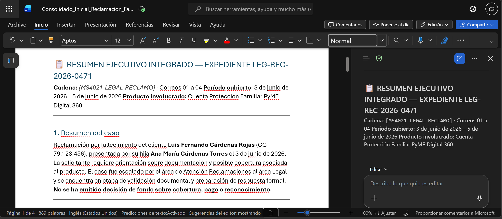

# Demostración 1. Preparar y organizar información del caso desde Outlook

## Objetivo de la práctica:
Al finalizar la práctica, serás capaz de:
- Usar Copilot en Outlook para resumir correos del caso con enfoque jurídico.
- Consolidar información clave sobre solicitud, documentos, riesgos y pendientes.
- Preparar un insumo trazable para el análisis posterior del expediente.

## Duración aproximada:
- 15 minutos.

## Tabla de ayuda:
| Elemento | Valor de referencia | Observaciones |
| --- | --- | --- |
| Curso | Custom MS-4021.8 BC (Priv) | Experiencia de inmersión para Legal. |
| Aplicación principal | Outlook con Microsoft 365 Copilot | Usar cuenta corporativa con licencia de Microsoft 365 Copilot. |
| Distintivo de búsqueda | `[MS4021-LEGAL-RECLAMO]` | Todos los correos del ejercicio contienen este distintivo. |
| Expediente ficticio | `LEG-REC-2026-0471` | Caso de reclamación por fallecimiento. |

## Instrucciones

### Tarea 1. Preparar el buzón y localizar correos del expediente.

**Paso 1.** Abrir Outlook con la cuenta corporativa asignada para la demostración.

>[!NOTE]
> Confirmar que el instructor haya importado, reenviado o copiado previamente los cuatro correos consolidados del kit ficticio. Cada correo contiene el contexto completo de una conversación y utiliza el distintivo `[MS4021-LEGAL-RECLAMO]` en el asunto.

**Paso 2.** Buscar en Outlook el distintivo `[MS4021-LEGAL-RECLAMO]`. Como búsqueda complementaria, usar palabras clave como: `fallecimiento`, `reclamación`, `expediente`, `acta de defunción`, `documentos`, `cumplimiento`, `beneficiario`, `cobertura`.

**Paso 3.** Identificar los cuatro correos consolidados del ejercicio:
- `[MS4021-LEGAL-RECLAMO] 01 - Solicitud inicial y documentación recibida - Expediente LEG-REC-2026-0471`.
- `[MS4021-LEGAL-RECLAMO] 02 - Consulta interna sobre requisitos documentales y clasificación del caso`.
- `[MS4021-LEGAL-RECLAMO] 03 - Requerimiento de cumplimiento y protección de datos`.
- `[MS4021-LEGAL-RECLAMO] 04 - Preparación de respuesta formal y próximos pasos`.

**Paso 4.** Marcar los correos que requieren seguimiento inmediato, especialmente los relacionados con cumplimiento, protección de datos, inconsistencias documentales y preparación de respuesta formal.

---

### Tarea 2. Usar Copilot en Outlook para resumir cada correo consolidado.

**Paso 1.** Abrir el primer correo relacionado con la solicitud inicial y documentación recibida.

**Paso 2.** Seleccionar Copilot en Outlook y solicitar un resumen ejecutivo del hilo.

Prompt sugerido:

```text
Resume esta cadena de correos desde una perspectiva jurídica y operativa para el área Legal de un banco. Identifica:
1. Tema principal.
2. Datos clave del expediente.
3. Documentos recibidos.
4. Documentos o validaciones pendientes.
5. Riesgos legales, regulatorios, operativos o de comunicación.
6. Áreas involucradas.
7. Decisiones o acciones pendientes.
8. Nivel de urgencia: alto, medio o bajo.
```

**Paso 3.** Revisar la respuesta de Copilot y validar que no agregue datos no mencionados en el correo.

**Paso 4.** Repetir el análisis con los otros tres correos consolidados.

---

### Tarea 3. Consolidar la información priorizada.

**Paso 1.** Solicitar a Copilot que integre los cuatro resúmenes en un solo bloque de contexto.

Prompt sugerido:

```text
Integra los resúmenes de los cuatro correos del expediente LEG-REC-2026-0471 en un solo bloque ejecutivo para el área Legal.

Organiza el resultado con esta estructura:
1. Resumen del caso.
2. Información recibida.
3. Documentos disponibles.
4. Documentos o validaciones pendientes.
5. Inconsistencias detectadas.
6. Riesgos legales, regulatorios, operativos y de comunicación.
7. Áreas involucradas.
8. Próximas acciones recomendadas.

Usa lenguaje claro, jurídico e institucional. No emitas una decisión final sobre cobertura, pago o reconocimiento.
```

**Paso 2.** Exportar a Word y asignar el nombre `Consolidado_Inicial_Reclamacion_Fallecimiento`.

>[!NOTE]
> Explicar a los participantes que este primer resultado no es una respuesta al cliente. Es el contexto que servirá para diseñar un prompt estructurado y analizar posteriormente los documentos del expediente.

### Resultado esperado
Al finalizar, el instructor debe contar con un consolidado inicial del expediente que incluya solicitud, documentos recibidos, pendientes, inconsistencias, riesgos y acciones necesarias para continuar el análisis jurídico.

| Elemento | Resultado esperado |
| --- | --- |
| Correos localizados | 4 correos consolidados con distintivo `[MS4021-LEGAL-RECLAMO]`. |
| Resúmenes | Síntesis de cada correo con foco en documentos, riesgos y pendientes. |
| Consolidado | Bloque único de contexto para Prompt Coach y Copilot Chat. |
| Validación humana | Revisión de datos sensibles, fuentes y afirmaciones no sustentadas. |



