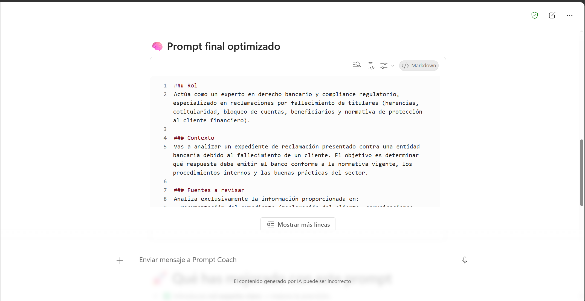
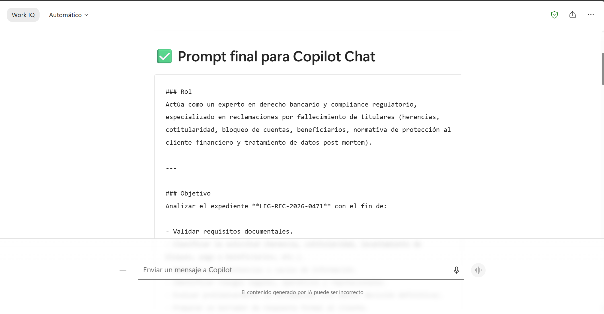
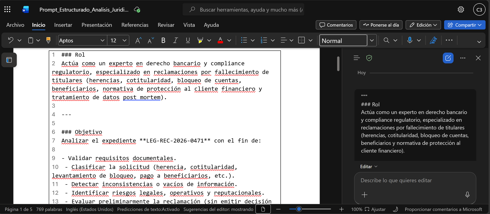

# Demostración 2. Diseñar prompts estructurados para el análisis jurídico con Prompt Coach

## Objetivo de la práctica:
Al finalizar la práctica, serás capaz de:
- Usar Prompt Coach para mejorar instrucciones, contexto y formato del análisis.
- Incorporar terminología jurídica y bancaria en un prompt reutilizable.
- Preparar un prompt final para analizar el expediente en Microsoft 365 Copilot Chat.

## Duración aproximada:
- 20 minutos.

## Tabla de ayuda:
| Elemento | Valor de referencia | Observaciones |
| --- | --- | --- |
| Aplicación principal | Microsoft 365 Copilot Chat y Prompt Coach | Usar modo chat o edición según disponibilidad. |
| Insumo | `Consolidado_Inicial_Reclamacion_Fallecimiento` | Generado en la Demostración 1. |
| Documentos fuente | Carpeta `02_datos` | Expediente ficticio de reclamación por fallecimiento. |
| Entregable | Prompt estructurado | Será usado en la Demostración 3. |

## Instrucciones

### Tarea 1. Comparar un prompt simple con un prompt estructurado.

**Paso 1.** Abrir Microsoft 365 Copilot Chat desde `https://m365.cloud.microsoft.com/`.

**Paso 2.** Pegar el consolidado inicial del caso generado en la demostración anterior.

**Paso 3.** Ejecutar un prompt simple para mostrar el punto de partida.

Prompt sugerido:

```text
Analiza este caso de reclamación por fallecimiento y dime qué debe responder el banco.
```

>[!NOTE]
>Explicar que un prompt simple puede producir respuestas útiles, pero suele dejar ambigüedades: no siempre separa hechos de supuestos, no valida fuentes, no conserva el formato institucional y puede generar conclusiones no sustentadas.

---

### Tarea 2. Usar Prompt Coach para mejorar el prompt.

**Paso 1.** Abrir Prompt Coach para analizar el prompt simple y generar recomendaciones de mejora.

Prompt sugerido:

```text
Ayúdame a mejorar este prompt para analizar un expediente legal bancario de reclamación por fallecimiento.

Prompt inicial:
"Analiza este caso de reclamación por fallecimiento y dime qué debe responder el banco."

Necesito que el nuevo prompt incluya:
- Rol experto.
- Contexto del caso.
- Fuentes que se deben revisar.
- Tareas descompuestas.
- Reglas de cumplimiento y privacidad.
- Formato de salida estructurado.
- Instrucción para no inventar datos.
- Separación entre hechos, supuestos e información pendiente.
```



**Paso 2.** Revisar la salida de Prompt Coach y analizar si es óptimo de acuerdo al contexto del caso, la claridad de instrucciones y el formato de salida.

---

### Tarea 3. Construir el prompt estructurado final.

**Paso 1.** Solicitar a Copilot que genere el prompt final con formato listo para usar.

Prompt sugerido:

```text
Con base en el prompt entregado, redacta un prompt final listo para usar en Microsoft 365 Copilot Chat. El prompt debe permitir analizar el expediente LEG-REC-2026-0471, validar requisitos documentales, clasificar la solicitud, detectar inconsistencias, identificar riesgos y preparar un borrador de respuesta formal.

Incluye secciones explícitas: Rol, Objetivo, Fuentes, Tareas, Reglas, Formato de salida y Validaciones.
```

**Paso 2.** Pedir a Copilot que agregue un ejemplo de formato de salida.

Prompt sugerido:

```text
Agrega al prompt un ejemplo de salida en formato de tabla para requisitos documentales, con las columnas: requisito, estado, evidencia, fuente, acción pendiente y observación legal.
```

**Paso 3.** Solicitar que el prompt incluya restricciones de seguridad y validación humana.

Prompt sugerido:

```text
Refina el prompt para que indique claramente que no se deben inventar datos, no se debe emitir decisión final sobre cobertura o pago, y toda respuesta debe quedar sujeta a revisión humana del área Legal y Cumplimiento.
```



---

### Tarea 4. Evaluar la mejora del prompt.

**Paso 1.** Ejecutar el prompt final en Copilot Chat y comparar la respuesta con la del prompt simple.

**Paso 2.** Guardar el prompt final en un documento o nota con el nombre `Prompt_Estructurado_Analisis_Juridico_Reclamacion`.

### Resultado esperado
Al finalizar, el instructor debe contar con un prompt estructurado que permita analizar el expediente legal, validar requisitos documentales, clasificar la solicitud y preparar una respuesta formal sin emitir conclusiones no sustentadas.

| Elemento | Resultado esperado |
| --- | --- |
| Prompt simple | Evidencia de limitaciones y ambigüedades. |
| Prompt estructurado | Instrucciones claras con rol, contexto, fuentes, reglas y formato. |
| Validaciones | Reglas de no invención, privacidad y revisión humana. |
| Uso posterior | Prompt listo para ejecutarse en Copilot Chat. |



