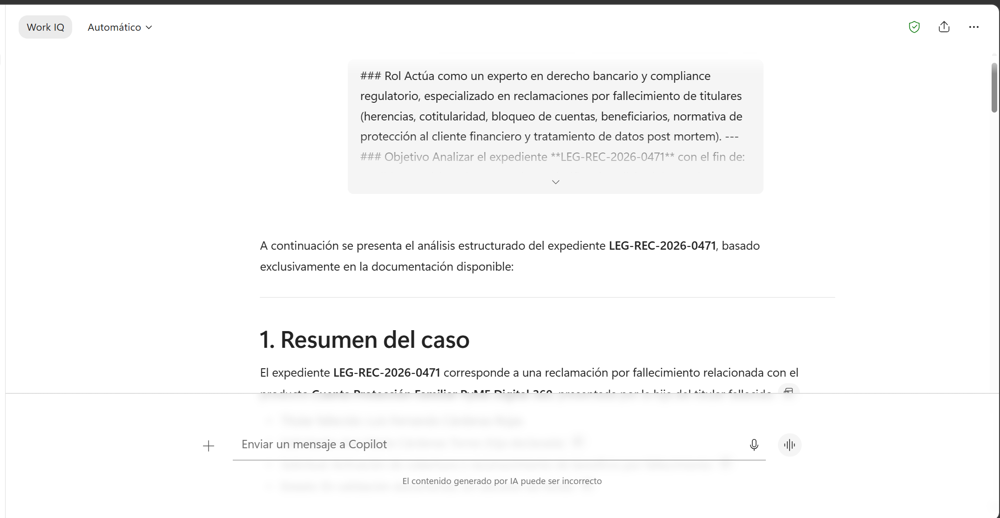
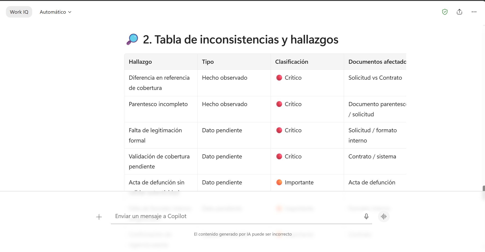
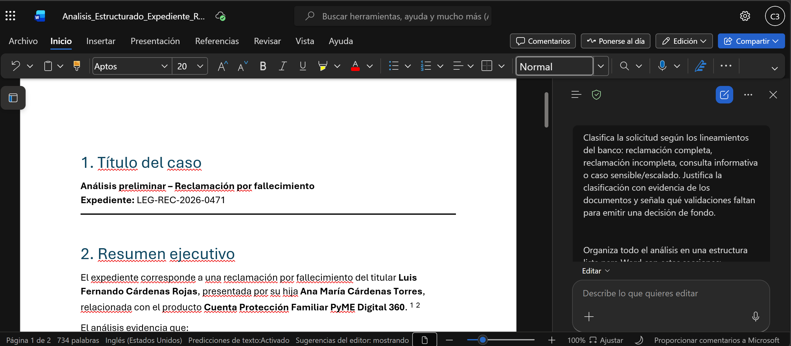

# Demostración 3. Analizar, clasificar y estructurar información del expediente con Microsoft 365 Copilot Chat

## Objetivo de la práctica:
Al finalizar la práctica, serás capaz de:
- Adjuntar documentos del expediente y ejecutar el prompt estructurado.
- Generar tablas de requisitos, inconsistencias, riesgos y ruta de respuesta.
- Exportar un resumen estructurado para usarlo en Word.

## Duración aproximada:
- 20 minutos.

## Tabla de ayuda:
| Elemento | Valor de referencia | Observaciones |
| --- | --- | --- |
| Aplicación principal | Microsoft 365 Copilot Chat | Usar modo Trabajo si está disponible. |
| Insumo previo | Prompt estructurado de la Demostración 2 | Copiar desde el documento o desde `04_prompts`. |
| Documentos fuente | Carpeta `02_expediente_legal` | Usar documentos ficticios. |
| Entregable | `Analisis_Estructurado_Expediente_Reclamacion` | Documento base para Word. |
| Validación | Revisión humana | No tomar decisiones legales automáticas. |

## Instrucciones

### Tarea 1. Preparar los documentos del expediente en Copilot Chat.

**Paso 1.** Abrir Microsoft 365 Copilot Chat desde `https://m365.cloud.microsoft.com/`.

**Paso 2.** Crear un nuevo chat y adjuntar o referenciar los siguientes archivos desde OneDrive o SharePoint:
- `01_Solicitud_Cliente_Reclamacion_Fallecimiento.docx`.
- `02_Acta_Defuncion_Ficticia.docx`.
- `03_Documento_Identidad_y_Parentesco_Ficticio.docx`.
- `04_Contrato_Producto_Cobertura_Fallecimiento.docx`.
- `05_Formato_Interno_Validacion_Documental.docx`.
- `06_Lineamientos_Regulatorios_y_Comunicacion_Legal.docx`.
- `07_Plantilla_Respuesta_Formal_Cliente.docx`.
- Consolidado inicial generado desde Outlook.


>[!Nota]
> Si Copilot no permite adjuntar todos los documentos a la vez, trabajar por bloques: primero documentos del caso, luego lineamientos y plantilla.

---

### Tarea 2. Ejecutar el prompt estructurado.

**Paso 1.** Pegar el prompt estructurado diseñado en la Demostración 2.

Prompt sugerido:

```text
Actúa como asesor legal bancario especializado en atención de reclamaciones, protección de datos y revisión documental. Analiza el expediente ficticio LEG-REC-2026-0471 usando únicamente la información contenida en los documentos adjuntos y el consolidado de Outlook.

Objetivo:
Clasificar la solicitud, validar requisitos documentales, identificar inconsistencias, separar hechos de supuestos y preparar insumos para una respuesta formal al solicitante.

Tareas:
1. Resumir el caso en máximo 150 palabras.
2. Extraer datos clave del expediente: solicitante, titular fallecido, producto, fechas, documentos y referencia de cobertura.
3. Validar requisitos documentales en una tabla con columnas: requisito, estado, evidencia, fuente, acción pendiente.
4. Clasificar la solicitud según las categorías del banco.
5. Comparar información entre documentos y detectar inconsistencias.
6. Separar hechos observados, supuestos inferidos e información pendiente.
7. Identificar riesgos legales, regulatorios, operativos y de comunicación.
8. Recomendar ruta de respuesta.
9. Generar un borrador base de respuesta formal sin prometer aprobación, pago, cobertura o decisión definitiva.

Reglas:
- No inventes datos no contenidos en las fuentes.
- Si falta información, indícalo como pendiente.
- Usa tono jurídico, claro, institucional y empático.
- Presenta el resultado con tablas claras y listas accionables.
```


---

### Tarea 3. Validar requisitos e inconsistencias.

**Paso 1.** Solicitar una tabla específica de requisitos documentales.

```text
Crea una tabla de validación documental con las columnas: requisito, estado, documento fuente, evidencia encontrada, información pendiente, acción recomendada y riesgo de no validar.
```

**Paso 2.** Solicitar identificación de inconsistencias entre documentos.

```text
Compara la solicitud, el contrato, el acta de defunción y el formato interno. Identifica inconsistencias, diferencias de referencia, datos que no coinciden o información que requiere confirmación. Clasifica cada hallazgo como crítico, importante o complementario.
```

**Paso 3.** Pedir separación entre hechos, supuestos y pendientes.

```text
Separa tu análisis en tres grupos: hechos observados en los documentos, supuestos inferidos y datos pendientes por validar. Presenta el resultado en una tabla clara para revisión del área Legal.
```



---

### Tarea 4. Clasificar la solicitud y preparar insumo para Word.

**Paso 1.** Solicitar clasificación de la solicitud.

```text
Clasifica la solicitud según los lineamientos del banco: reclamación completa, reclamación incompleta, consulta informativa o caso sensible/escalado. Justifica la clasificación con evidencia de los documentos y señala qué validaciones faltan para emitir una decisión de fondo.
```

**Paso 2.** Solicitar un resumen estructurado para Word.

```text
Organiza todo el análisis en una estructura lista para Word con estas secciones:
1. Título del caso.
2. Resumen ejecutivo.
3. Datos clave del expediente.
4. Documentos recibidos.
5. Documentos o validaciones pendientes.
6. Inconsistencias detectadas.
7. Riesgos legales, regulatorios, operativos y de comunicación.
8. Clasificación de la solicitud.
9. Ruta recomendada de respuesta.
10. Borrador base de comunicación formal.
```

**Paso 3.** Exportar el resultado a Word o copiarlo en un documento llamado `Analisis_Estructurado_Expediente_Reclamacion`.

>[!Nota]
> Confirmar con los participantes que Copilot ayuda a organizar y analizar, pero no reemplaza la revisión jurídica. Toda clasificación, conclusión y respuesta formal debe ser validada por el área competente.

### Resultado esperado
Al finalizar, el instructor debe contar con un análisis jurídico estructurado del expediente, con requisitos cumplidos y pendientes, inconsistencias detectadas, clasificación preliminar de la solicitud y ruta de respuesta recomendada.

| Sección | Resultado esperado |
| --- | --- |
| Resumen ejecutivo | Síntesis clara del expediente de reclamación por fallecimiento. |
| Requisitos | Tabla con documentos cumplidos, pendientes y acciones. |
| Inconsistencias | Identificación de diferencias entre solicitud y contrato. |
| Clasificación | Reclamación incompleta o caso que requiere validación antes de fondo. |
| Ruta de respuesta | Acuse formal, solicitud de subsanación y revisión interna. |


