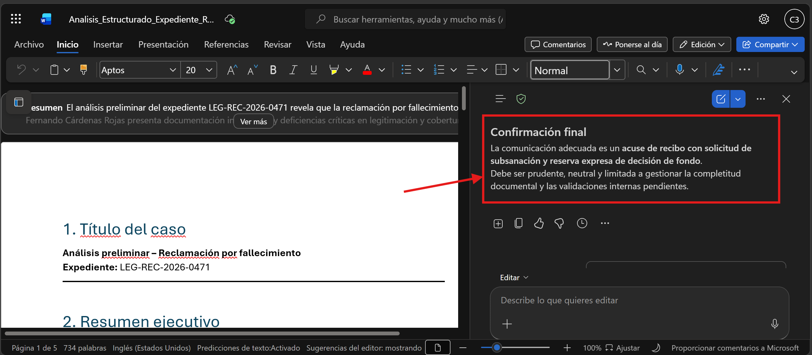
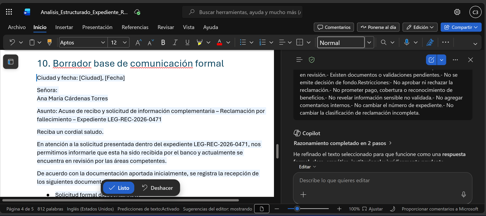
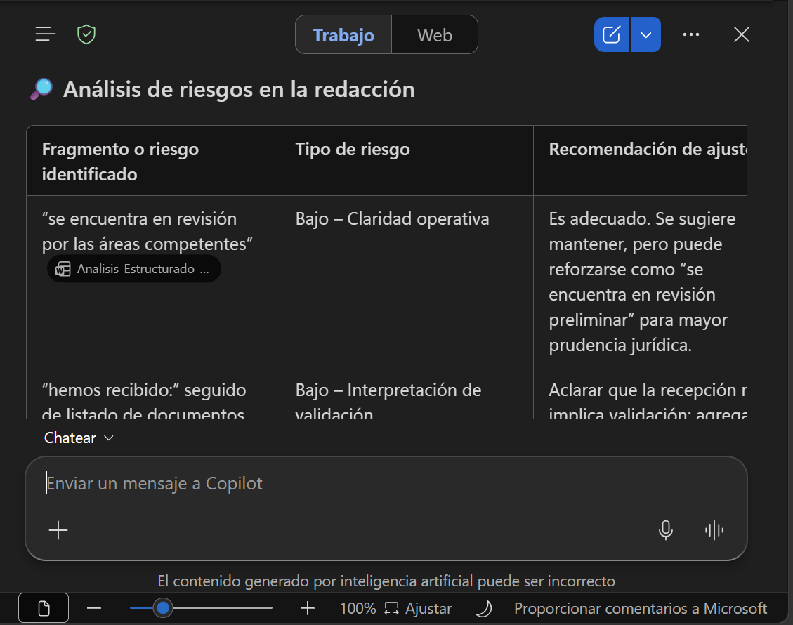
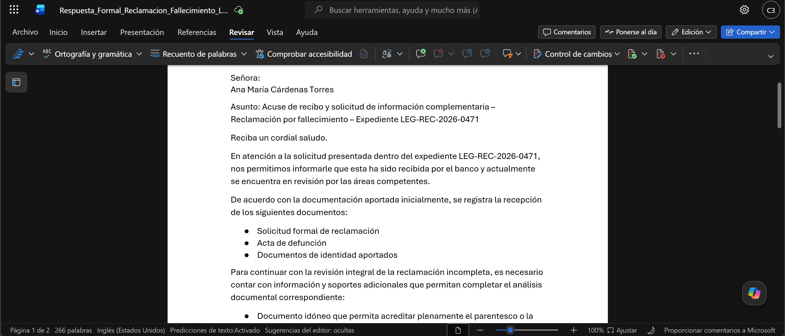

# Demostración 4. Generar una respuesta jurídica estructurada y reutilizable con Copilot en Word

## Objetivo de la práctica:

Al finalizar la práctica, serás capaz de:
- Usar Copilot en Word para convertir un análisis jurídico estructurado en una comunicación formal controlada.
- Generar una respuesta formal alineada al estado del expediente, sin emitir decisión de fondo.

## Duración aproximada:

* 20 minutos.

## Tabla de ayuda:

| Elemento                | Valor de referencia                                                 | Observaciones                                   |
| ----------------------- | ------------------------------------------------------------------- | ----------------------------------------------- |
| Aplicación principal    | Word con Microsoft 365 Copilot                                      | Usar cuenta corporativa con acceso a Copilot.   |
| Insumo requerido        | `Analisis_Estructurado_Expediente_Reclamacion.docx`                 | Documento generado en la Demostración 3.        |
| Expediente              | `LEG-REC-2026-0471`                                                 | Caso ficticio de reclamación por fallecimiento. |


## Instrucciones

### Tarea 1. Confirmar el tipo de comunicación que corresponde al caso.

**Paso 1.** Abrir Microsoft Word en el navegador o en la aplicación de escritorio.

**Paso 2.** Abrir el documento `Analisis_Estructurado_Expediente_Reclamacion.docx`.

**Paso 3.** Revisar brevemente las secciones principales del documento:

* Resumen ejecutivo.
* Documentos recibidos.
* Documentos o validaciones pendientes.
* Inconsistencias detectadas.
* Clasificación de la solicitud.
* Ruta recomendada de respuesta.
* Borrador base de comunicación formal.

**Paso 4.** Abrir el panel de Copilot en Word.

> [!Nota]
> En esta tarea se usa **Copilot en Word en modo chat**. El objetivo es conversar con el documento y confirmar la salida procedimental del caso, sin modificar el contenido.

**Paso 5.** Solicitar a Copilot que confirme qué tipo de comunicación corresponde según el análisis del expediente.

Prompt sugerido:

```text
Con base en este documento de análisis estructurado del expediente LEG-REC-2026-0471, confirma qué tipo de comunicación formal corresponde preparar para la solicitante.

No redactes todavía una nueva respuesta.

Identifica:
1. Clasificación de la solicitud.
2. Tipo de comunicación recomendada.
3. Justificación.
4. Documentos recibidos.
5. Documentos o validaciones pendientes.
6. Riesgos de comunicación.
7. Información que no debe mencionarse todavía.

Ten en cuenta que no se debe emitir decisión de fondo sobre aprobación, rechazo, pago, cobertura o reconocimiento de beneficios.
```

**Paso 6.** Verificar que Copilot identifique que la salida correcta corresponde a una **reclamación incompleta** y que la comunicación recomendada es un **acuse formal de recepción con requerimiento de subsanación documental**.

> [!Nota]
> Explicar a los participantes que este es el punto de cierre jurídico-procedimental del caso práctico: el expediente no está listo para decisión de fondo, por lo tanto, la respuesta debe limitarse a informar recepción, estado de revisión y requisitos pendientes.



---

### Tarea 2. Preparar la respuesta formal a partir del borrador base.

**Paso 1.** En el documento, localizar la sección **10. Borrador base de comunicación formal**.

**Paso 2.** Seleccionar únicamente el texto del borrador base, desde `Ciudad y fecha` hasta `Área Legal y Atención de Reclamaciones`.

**Paso 3.** Usar Copilot en Word para mejorar el texto seleccionado.

> [!Nota]
> En esta tarea se usa **Copilot en Word en modo edición**. El objetivo es modificar o mejorar el texto seleccionado dentro del documento, no conversar de forma general con el archivo.

Prompt sugerido:

```text
Refina el texto seleccionado para convertirlo en una respuesta formal clara, empática, institucional y jurídicamente prudente.

Mantén el sentido del documento:
- La solicitud está recibida.
- El expediente está en revisión.
- Existen documentos o validaciones pendientes.
- No se emite decisión de fondo.

Restricciones:
- No aprobar ni rechazar la reclamación.
- No prometer pago, cobertura o reconocimiento de beneficios.
- No revelar información sensible no validada.
- No agregar comentarios internos.
- No cambiar el número de expediente.
- No cambiar la clasificación de reclamación incompleta.
```

**Paso 4.** Revisar la versión propuesta por Copilot antes de conservarla.

**Paso 5.** Validar que el texto conserve los elementos mínimos:

* Saludo formal.
* Confirmación de recepción.
* Referencia general al expediente.
* Documentos recibidos.
* Documentos o validaciones pendientes.
* Indicación de revisión por áreas competentes.
* Aclaración de que no hay decisión definitiva.
* Canales o próximos pasos.
* Cierre institucional.


---

### Tarea 3. Revisar riesgos de redacción antes de cerrar el borrador.

**Paso 1.** Mantener abierto el mismo documento en Word.

**Paso 2.** Abrir Copilot en Word y solicitar una revisión crítica del borrador.

> [!Nota]
> En esta tarea se usa **Copilot en Word en modo chat**. El objetivo es pedir una revisión del texto sin modificarlo automáticamente.

Prompt sugerido:

```text
Revisa el borrador de respuesta formal incluido en este documento.

Identifica posibles riesgos en la redacción:
1. Frases que puedan interpretarse como aprobación, rechazo o decisión definitiva.
2. Frases que puedan generar expectativa de pago, cobertura o reconocimiento de derechos.
3. Frases que puedan revelar información sensible sin legitimación validada.
4. Frases que puedan afectar la prudencia jurídica o regulatoria.
5. Ajustes recomendados para mejorar claridad, tono institucional y protección de datos.

Entrega el resultado en una tabla con las columnas:
- Fragmento o riesgo identificado.
- Tipo de riesgo.
- Recomendación de ajuste.
```

**Paso 3.** Revisar las recomendaciones de Copilot y decidir cuáles aplicar.



**Paso 4.** Si se identifican frases riesgosas, seleccionar el fragmento correspondiente y usar Copilot en **modo edición** para reescribirlo.

Prompt sugerido:

```text
Reescribe el texto seleccionado aplicando un tono más prudente, claro e institucional.

Evita cualquier frase que pueda interpretarse como aceptación, rechazo, promesa de pago, confirmación de cobertura o decisión definitiva.
```

---

### Tarea 4. Crear la versión final del borrador de respuesta formal.

**Paso 1.** Crear un nuevo documento de Word.

**Paso 2.** Copiar la versión refinada de la respuesta formal.

**Paso 3.** Pegarla en el nuevo documento.

**Paso 4.** Guardar el archivo con el nombre:

`Respuesta_Formal_Reclamacion_Fallecimiento_LEG-REC-2026-0471.docx`

**Paso 5.** Confirmar que el documento contiene únicamente la comunicación dirigida a la solicitante.

> [!Nota]
> El documento de respuesta formal no debe incluir checklist interno, razonamientos jurídicos, comentarios del análisis, matriz de riesgos ni notas para Legal. Es una comunicación externa preliminar que queda sujeta a revisión humana.

---

### Resultado esperado

El resultado esperado no es una decisión final del caso. El cierre correcto de la demostración es que Copilot ayuda a transformar el análisis estructurado en una respuesta formal controlada, prudente y reutilizable, manteniendo la revisión final bajo responsabilidad humana del área Legal y Cumplimiento.

| Elemento               | Resultado esperado                                           |
| ---------------------- | ------------------------------------------------------------ |
| Clasificación del caso | Reclamación incompleta.                                      |
| Tipo de comunicación   | Acuse formal de recepción y requerimiento de subsanación.    |
| Decisión de fondo      | No se emite.                                                 |
| Riesgo controlado      | No se promete pago, cobertura ni reconocimiento de derechos. |
| Documento externo      | Respuesta formal preliminar para revisión.                   |
| Documento reutilizable | Modelo editable para casos similares.                        |

